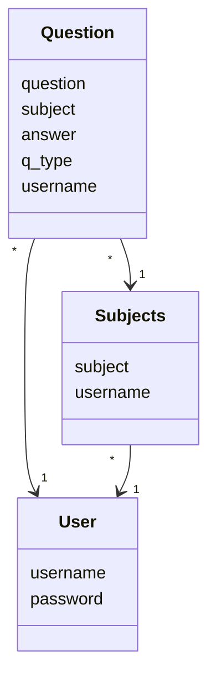
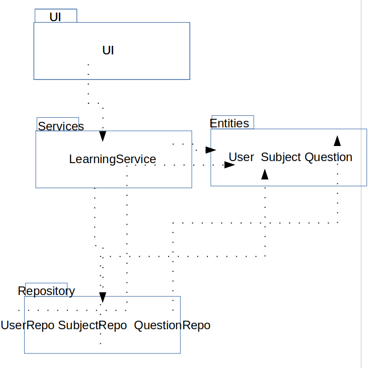
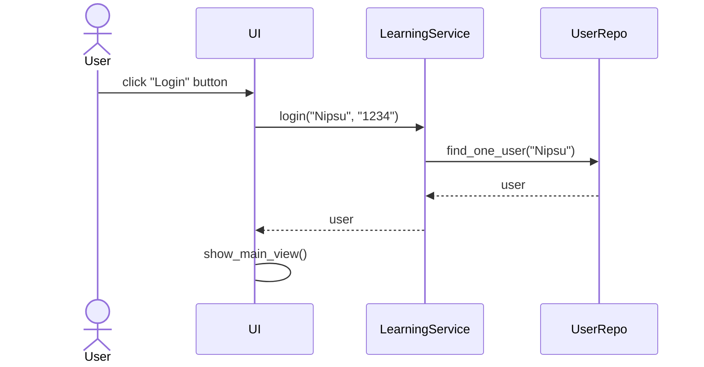
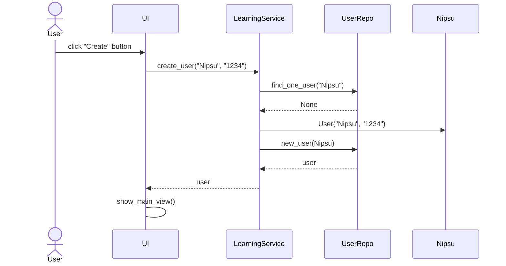
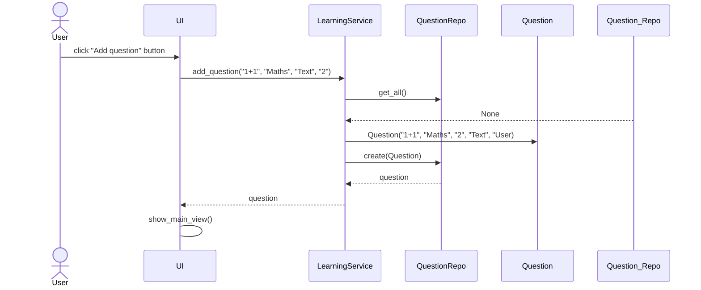

# Sovelluksen arkkitehtuuri

## Rakenne 

Koodin pakkausrakenne on seuraavanlainen:

UI sisältää käyttöliittymän, services sisältää sovelluslogiikan, repository sisältää tietokanta koodin ja entities sisältää luokkia jotka kuvaavat eri tietokanta tauluja joihin tiedot tallennetaan.

## Käyttöliittymä 

Käyttöliittymä sisältää seitsemän erillistä näkymää:

- Kirjautuminen
- Uuden käyttäjän luominen
- Aloitus
- Asetus näkymä
- Kysmys näkymä
- Uuden kysymyksen luonti
- Tulos näkymä

Jokainen näistä on toteutettu omana luokkana. Näkymistä on aina vain yksi esillä. Käyttöliittymä on pyritty eristämään sovelluksen logiikasta ja kutsuua ainoastaan LearningService-luokkaa.

## Sovelluslogiikka

Sovelluksen loogisen tietomallin muodostavat luokat [User](https://github.com/Kappe01/OT_harjoitustyo/blob/master/src/entities/user.py), [Subjects](https://github.com/Kappe01/OT_harjoitustyo/blob/master/src/entities/subjects.py) ja [Question](https://github.com/Kappe01/OT_harjoitustyo/blob/master/src/entities/questions.py), jotka kuvaavat käyttäjiä, aiheita ja kysymyksiä.

Toiminnallisuudesta vastaa luokka [LearningService](https://github.com/Kappe01/OT_harjoitustyo/blob/master/src/services/learning_services.py). Luokka tarjoaa kaikille käyttöliittymän toiminnoille oman metodin. 

_LearningService_pääsee käsiksi käyttäjiin, aiheisiin sekä kysymyksiin tietojen tallennuksesta vastaavan pakkauksen _repository_ sijaitsevien luokkien [UserRepo](https://github.com/Kappe01/OT_harjoitustyo/blob/master/src/repository/user_repository.py), [SubjectRepo](https://github.com/Kappe01/OT_harjoitustyo/blob/master/src/repository/subject_repository.py) ja [QuestionRepo](https://github.com/Kappe01/OT_harjoitustyo/blob/master/src/repository/question_repository.py) kautta.

Ohjelman osien suhdetta kuvaava luokka/pakkauskaavio:

## Tietojen pysyväistallennus

Kaikki tiedot tallennetaan SQLite-tietokantaan.

## Päätoiminnallisuudet

Kuvataan seuraavaksi sovelluksen toimintalogiikkaa muutaman päätoiminnallisuuden osalta sekvenssikaaviona.

### Käyttäjän kirjautuminen

Kun kirjautumisnäkymän syöttökenttiin kirjoitetaan käyttäjätunnus ja salsana, jonka jälkeen kilikataan painiketta _Login_, etenee sovelluksen kontrolli seuraavasti:

### Uuden käyttäjän luominen

Kun uuden käyttäjän luomisnäkymään on syötetty käyttäjätunnus jota ei ole olemassa sekä salasana, jonka jälkeen painetaan _Create_, etenee sovelluksen kontrolli seuraavasti:

### Uuden kysymyksen luominen

Kun uuden kysymyksen näkymään on lisätty tarvittavat tiedot ja painettu painiketta _Add question_, etenee sovelluksen kontrolli seuraavasti:

