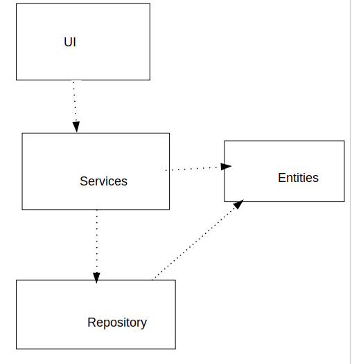

# Sovelluksen arkkitehtuuri

## Rakenne 

Koodin pakkausrakenne on seuraavanlainen:

UI sisältää käyttöliittymän, services sisältää sovelluslogiikan, repository sisältää tietokanta koodin ja entities sisältää luokkia jotka kuvaavat eri tietokanta tauluja joihin tiedot tallennetaan.
