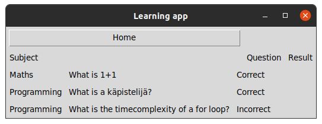

# Käyttöohje

Lataa projektin viimeisin [release](https://github.com/Kappe01/OT_harjoitustyo/releases/tag/loppupalautus) lähdekoodi valitsemalla _Assets_-osion alta _Source code_.

## Konfigurointi

Tallennukseen käytettävien tiedostojen nimiä voi halutessaan konfiguroida käynnistyshakemistossa _.env_-tiedostossa. Tiedostot luodaan automaattisesti _data_-hakemistoon, jos niitä ei siellä vielä ole. Tiedoston muoto on seuraava:

```
DB_FILENAME=db.sqlite
```

## Ohjelman käynnistäminen

Ennen ohjelman käynnistämistä, asenna riippuvuudet komennolla:

```bash
poetry install
```

Jonka jälkeen suorita alustustoimenpiteet komennolla:

```bash
poetry run invoke build
```

Nyt ohjelman voi käynnistää komennolla:

```bash
poetry run invoke start
```

## Kirjautuminen

Sovellus käynnistyy kirjautumisnäkymään:


Kirjautuminen onnistuu syöttämällä olemassa oleva käyttäjänimi sekä salasana ja painamalla __Login__ painiketta.

## Uuden käyttäjän luominen

Kirjautumisesta voidaan siirtyä uuden käyttäjän luomis näkymään painamalla __Create user__. 

Uuden käyttäjän voi luoda syöttämällä tiedot kenttiin ja painamalla __Create__:


Painamalla __Login__ siirrymme takasin kirjautumis näkymään.

## Päänäkymä

Kun ollaan kirjauduttu sisään pääsemme päänäkymään:


Päänäkymästä pystymme kirjautumaan ulos painamalla  __Logout__, lisäämään kysymyksiä painamalla __New Question__, katsomaan tuloksia painamlla __Results__, tarkastelemaan asetuksia painamalla __Settings__ sekä aloittamaan kysely session painamalla __Start__.

## Asetukset

Pääsemme tarkastelemaan kysymyksiä painamalla päänäkymästä __Asetukset__:


Painamlla __Add default questions__ lisätään kysymykset jotka näkyvät kuvassa. Painamalla __Delete__ poistetaan kyseinen kysymys. 

Painamalla __Home__ palaamme takasin päänäkymään. 

## Kysymys

Valitsemalla pääikkunasta halutut aiheet ja kysymyksen määrä ja painamalla __Start__ alkaa kysymykset:


Kysymys näkyy __Cancel__ painikkeen alla joka myös lopettaa kysymykset ja palaa pääikkunaan. Kysymykseen vastataan kysymyksen alla olevaan kohtaan. 

Painamalla __Check correct answer__ tulee vastaus näkymään painikkeen alle. Jos vastaus on oman tulkinnan mukaan oikein paina __Correct__ ja jos vastaus on väärin __Incorrect__. Tämän jälkeen tulee seuraava kysymys näkyviin. Jos kysymyksiä ei enää ole tulee tulokset näkyviin.

## Tulokset

Tulos näkymään pääsee joko painamalla päänäkymästä __Results__ tai kun kaikkiin kysymyksiin on vastattu:



Tuloksista näet aiheen, kysymyksen ja oletko vastannut oikein vai väärin.

## Uuden kysymyksen luonti

Jos haluat luoda omia kysymyksiä paina päänäkymässä __New Question__ painiketta:


Täyttämällä kysytyt tiedot ja painamalla __Add question__ lisäät kysymyksen tietokantaan.
