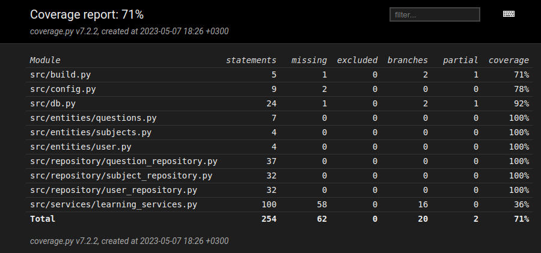

# Testausdokumentti

Ohjelmaa on testattu sekä automatisoiduin yksikkö- ja integraatiotestein unittestilla sekä manuaalisesti tapahtunein järjestelmätason testein.

## Yksikkö- ja integraatiotestaus

### Sovelluslogiikka

Sovellus logiikkaa ei ole testattu automaattisin testein. Vain manuallisesti käyttöliittymän kautta.

### Repository-luokat

Repoistory-luokkia `UserRepo`, `SubjectRepo` sekä `QuestionRepo` testataan ainoastaan testeissä käytössäolevilla tiedostoilla. Tiedostojen nimet on konfiguroitu _.env.test_-tiedostoon.

`UserRepo`-luokkaa testataan [TestUserRepository](https://github.com/Kappe01/OT_harjoitustyo/blob/master/src/tests/repositories/user_repoistory_test.py)-testiluokalla, `SubjectRepo`-luokkaa testataan [TestSubjectRepository](https://github.com/Kappe01/OT_harjoitustyo/blob/master/src/tests/repositories/subject_repoistory_test.py)-testiluokalla ja `QuestionRepo`-luokkaa testataan [TestQuestionRepository](https://github.com/Kappe01/OT_harjoitustyo/blob/master/src/tests/repositories/question_repoistory_test.py)-testiluokalla.

### Testauskattavuus

Käyttöliittymäkerrosta lukuunottamatta sovelluksen testaus haarautumakattavuus on 71% 

## Järjestelmätestaus

Sovelluksen järjestelmätestaus on suoritettu manuaalisesti.

### Asennus ja konfigurointi

Sovellus on haettu ja sitä on testattu [käyttöohjeen](./kayttoohje.md) kuvaamalla tavalla Linux-ympäristössä.
