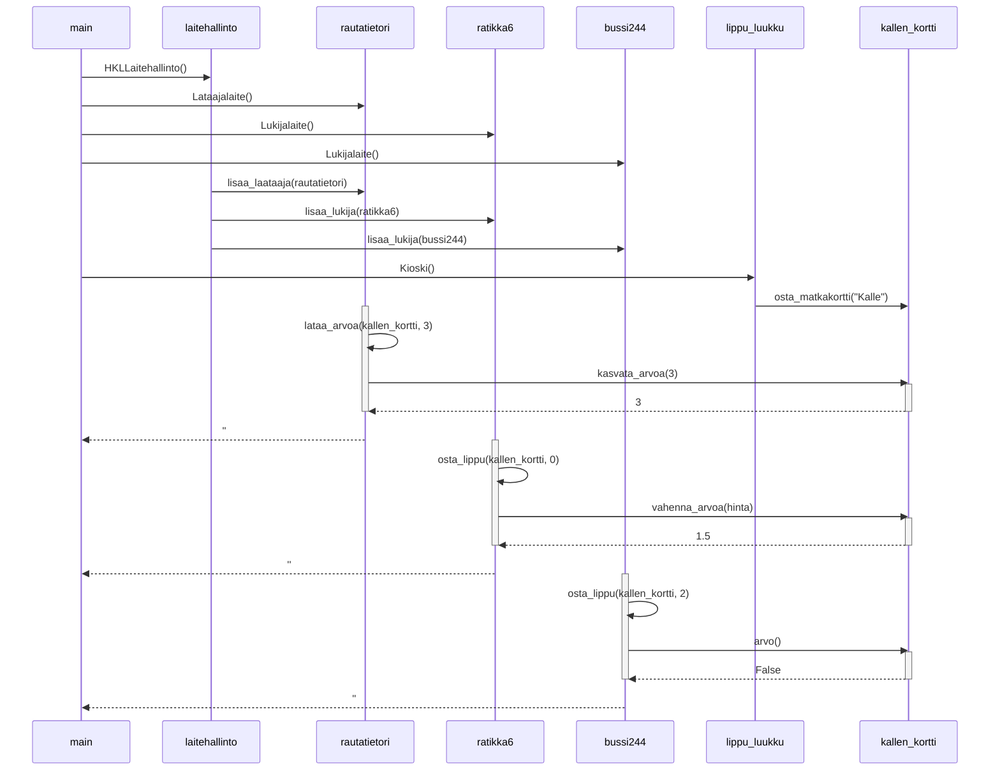

## Sekvenssikaavio

```mermaid
sequenceDiagram
  participant main
  main->>laitehallinto: HKLLaitehallinto()
  main->>rautatietori: Lataajalaite()
  main->>ratikka6: Lukijalaite()
  main->>bussi244: Lukijalaite()
  laitehallinto->>rautatietori: lisaa_laataaja(rautatietori)
  laitehallinto->>ratikka6: lisaa_lukija(ratikka6)
  laitehallinto->>bussi244: lisaa_lukija(bussi244)
  main ->>lippu_luukku: Kioski()
  lippu_luukku->>kallen_kortti: osta_matkakortti("Kalle")
  activate rautatietori
  rautatietori->>rautatietori: lataa_arvoa(kallen_kortti, 3)
  rautatietori->>kallen_kortti: kasvata_arvoa(3)
  activate kallen_kortti
  kallen_kortti-->>rautatietori: 3
  deactivate kallen_kortti
  deactivate rautatietori
  rautatietori-->>main: ''
  activate ratikka6
  ratikka6->>ratikka6: osta_lippu(kallen_kortti, 0)
  ratikka6->>kallen_kortti: vahenna_arvoa(hinta)
  activate kallen_kortti
  kallen_kortti-->>ratikka6: 1.5
  deactivate kallen_kortti
  deactivate ratikka6
  ratikka6-->>main: ''
  activate bussi244
  bussi244->>bussi244: osta_lippu(kallen_kortti, 2)
  bussi244->>kallen_kortti: arvo()
  activate kallen_kortti
  kallen_kortti-->>bussi244: False
  deactivate kallen_kortti
  deactivate bussi244
  bussi244-->>main: ''
```
