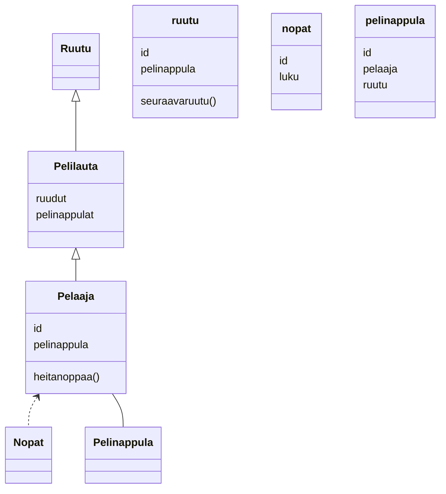

## Monopoly luokkakaavio

```mermaid
classDiagram
    Pelilauta <|-- Pelaaja
    Pelaaja <.. Nopat
    Ruutu <|-- Pelilauta
    Pelaaja -- Pelinappula
    class Pelilauta{
        ruudut
        pelinappulat
    }
    class Pelaaja{
        id
        pelinappula
        heitanoppaa()
    }
    class ruutu{
        id
        seuraavaruutu()
        pelinappula
    }
    class nopat{
        id
        luku
    }
    class pelinappula{
        id
        pelaaja
        ruutu
    }
```