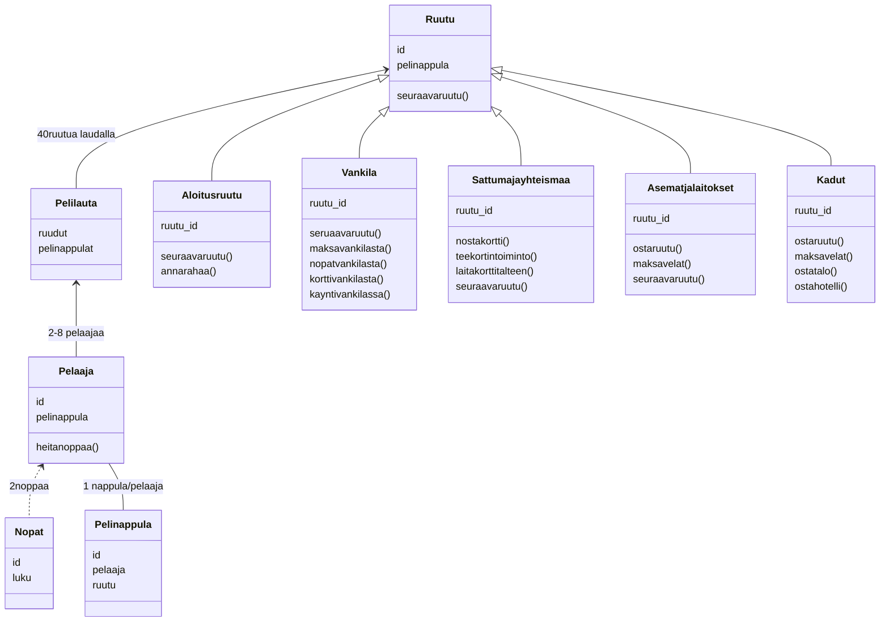

## Monopoly luokkakaavio

```mermaid
classDiagram
    Pelilauta <-- Pelaaja : 2-8 pelaajaa
    Pelaaja <.. Nopat : 2noppaa
    Ruutu <-- Pelilauta : 40ruutua laudalla
    Pelaaja -- Pelinappula : 1 nappula/pelaaja
    Ruutu <|-- Aloitusruutu
    Ruutu <|-- Vankila
    Ruutu <|-- Sattumajayhteismaa
    Ruutu <|-- Asematjalaitokset
    Ruutu <|-- Kadut
    class Pelilauta{
        ruudut
        pelinappulat
    }
    class Pelaaja{
        id
        pelinappula
        heitanoppaa()
    }
    class Ruutu{
        id
        seuraavaruutu()
        pelinappula
    }
    class Nopat{
        id
        luku
    }
    class Pelinappula{
        id
        pelaaja
        ruutu
    }
    class Aloitusruutu{
        ruutu_id
        seuraavaruutu()
        annarahaa()
    }
    class Vankila{
        ruutu_id
        seruaavaruutu()
        maksavankilasta()
        nopatvankilasta()
        korttivankilasta()
        kayntivankilassa()
    }
    class Sattumajayhteismaa{
        ruutu_id
        nostakortti()
        teekortintoiminto()
        laitakorttitalteen()
        seuraavaruutu()
    }
    class Asematjalaitokset{
        ruutu_id
        ostaruutu()
        maksavelat()
        seuraavaruutu()
    }
    class Kadut{
        ruutu_id
        ostaruutu()
        maksavelat()
        ostatalo()
        ostahotelli()
    }
```
