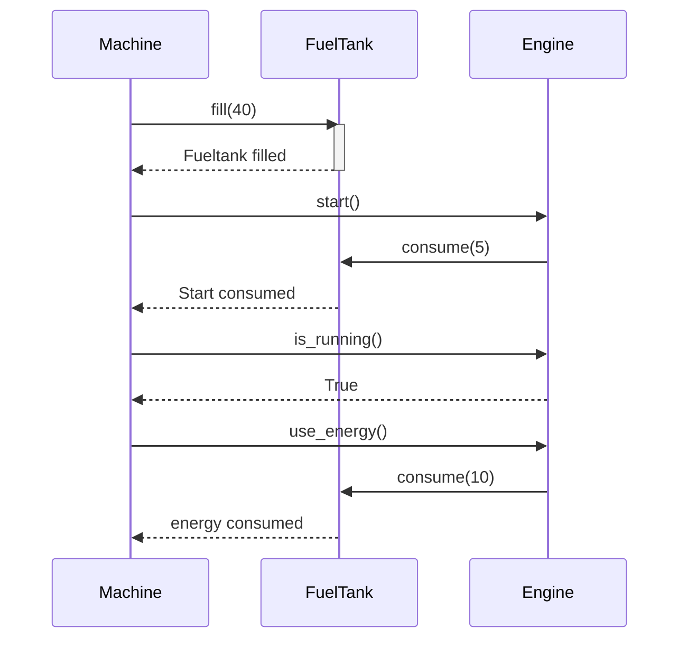

## Sekvenssikaavio

```mermaid
sequenceDiagram
    participant Machine
    participant FuelTank
    participant Engine
    Machine->>FuelTank: fill(40)
    activate FuelTank
    FuelTank-->>Machine: Fueltank filled
    deactivate FuelTank
    Machine->>Engine: start()
    Engine->>FuelTank: consume(5)
    FuelTank-->>Machine: Start consumed
    Machine->>Engine: is_running()
    Engine-->>Machine: True
    Machine->>Engine: use_energy()
    Engine->>FuelTank: consume(10)
    FuelTank-->>Machine: energy consumed
```
